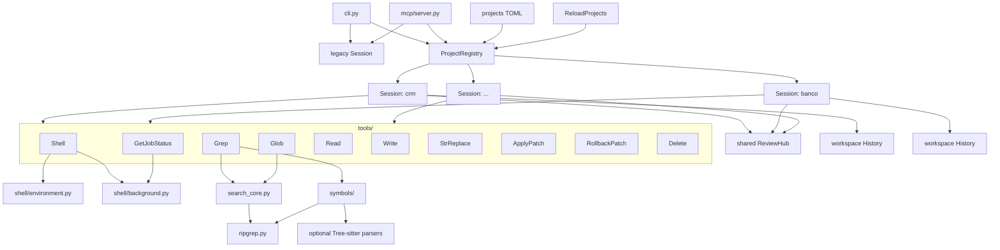
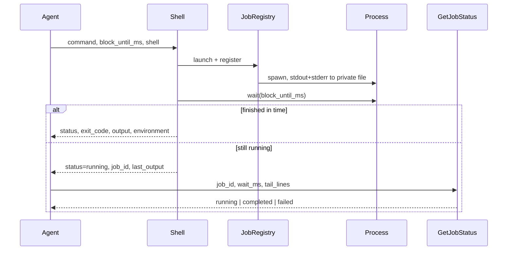

# Architecture

The package keeps tool implementations deliberately flat, while the MCP layer can
route one process across several isolated project sessions. Each tool still receives
a `PathGuard` (and stateful services such as `JobRegistry` / `HistoryManager`) for
exactly one selected project.

| Module | Responsibility |
|--------|----------------|
| `paths.py` | Resolves paths and rejects anything outside the allowed roots |
| `ripgrep.py` | Finds the `rg` executable and runs it |
| `errors.py` | The handful of typed failures, each with a stable `code` |
| `session.py` | Binds one project root to its guard, jobs, history, and workspace review facade |
| `projects.py` | Parses named startup/config, owns `ProjectRegistry`, session leases, allowed roots, and transactional reload |
| `history.py` | Persists explicit patch groups and immutable transactions per workspace, plus snapshots, retention, and rollback |
| `tools/` | One module per tool; Grep/Glob share `search_core.py` |
| `tools/search_core.py` | Shared Grep/Glob internals (not an MCP tool) |
| `tools/search_ignores.py` | Source-first ignore defaults + `.code-harnessignore` |
| `tools/search_globs.py` | Brace expansion and multi-pattern normalization |
| `tools/search_hints.py` | Generic suggestions when Grep/Glob find nothing |
| `symbols/` | Language extractors, optional parsers, symbols, and syntactic references |
| `shell/environment.py` | Shell discovery, argv construction, syntax diagnostics |
| `shell/background.py` | Per-session job registry, process lifecycle, bounded log tails, and reload-safe running-job checks |
| `review/` | Workspace review services behind one loopback `ReviewHub` when a named registry is active |
| `mcp/server.py` | FastMCP registration over stdio or Streamable HTTP; resolves project aliases per request and uses session leases during reload |
| `cli.py` | The same tools behind typer commands plus legacy/named/persistent MCP startup options |

There is no index or database in v1. `Grep` and `Glob` remain the MCP surface.
Content search shells out to ripgrep via `search_core`. `output_mode=symbols`
uses on-demand extractors behind a `SymbolStore` facade (replaceable by an
index later). `output_mode=references` uses ripgrep to preselect candidates and
optional in-process Tree-sitter parsers to classify identifiers; it creates no
persistent index. See [search-improvements.md](search-improvements.md).

## Multi-project routing and reload

Named startup creates one `ProjectRegistry` containing one isolated `Session` per
alias. Omitting `project` resolves the configured default; an explicit unknown
alias never falls back. Legacy startup with one raw `--project PATH` still uses a
single `Session` and requires clients to omit the alias parameter.

A persistent TOML registry adds `allowed_project_roots` as a control-plane
boundary. `ReloadProjects()` rereads only the startup config file, validates the
whole candidate registry, reuses sessions whose alias/root are unchanged, creates
new sessions before the swap, and retires removed/repointed sessions only after a
successful swap. Session leases prevent a reload from retiring a project while an
MCP request is using it; running shell jobs and unreviewed applied transactions
also block destructive retirement.

All named sessions share one loopback review HTTP server, but keep separate
`PathGuard`, `JobRegistry`, and `HistoryManager` instances. Therefore one stdio or
Streamable HTTP MCP endpoint—and consequently one tunnel to that endpoint—can
serve every configured project without broadening any individual filesystem root.

## Why paths are confined

`Write`, `StrReplace`, `ApplyPatch`, and `Delete` mutate the filesystem, so `PathGuard`
resolves each path and requires the result to sit under an allowed root. Shell
job logs live in a scratch directory outside the project and are never exposed
as readable paths; agents follow them only through `GetJobStatus`.

## Shell lifecycle

Exit codes always come from `process.returncode`, never from log text. Job
status is derived from the process and exit code. `JobRegistry.cleanup()`
terminates whatever is still running and removes the scratch directory; the MCP
lifespan calls it when the server stops.

## Testing

`tests/` covers each tool against a temporary sample project. Tests that need
ripgrep are skipped when it is absent, so the suite still runs on a bare
machine.
