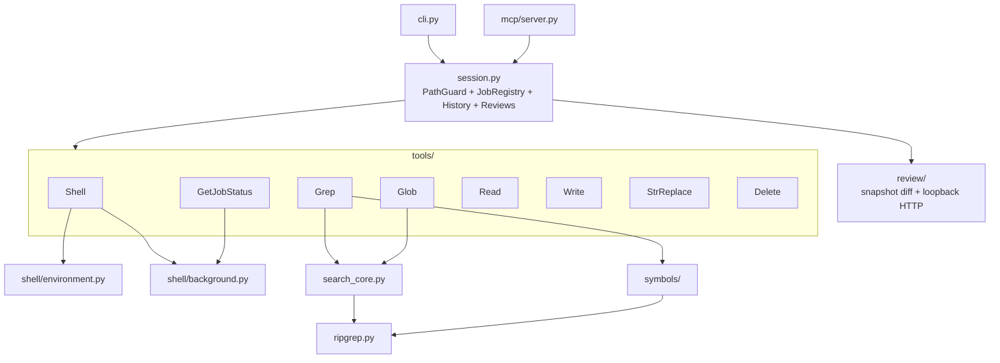
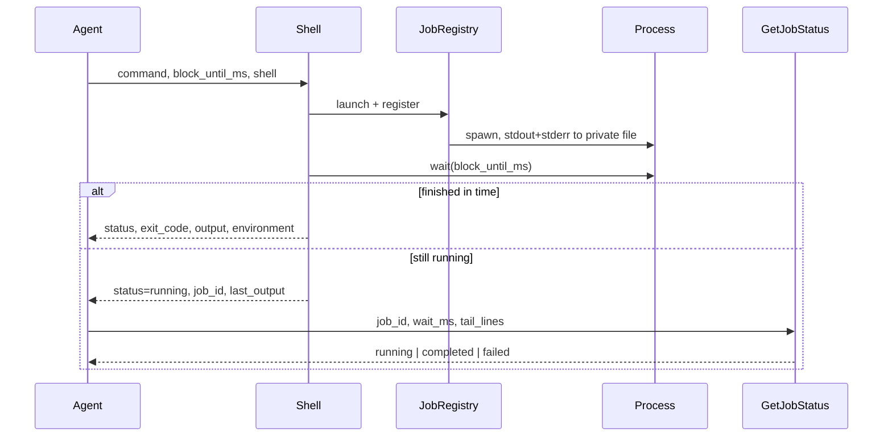

# Architecture

The package is deliberately flat. A tool is a function that takes a `PathGuard`
(and, for shell tools, a `JobRegistry`) plus keyword arguments.

| Module | Responsibility |
|--------|----------------|
| `paths.py` | Resolves paths and rejects anything outside the allowed roots |
| `ripgrep.py` | Finds the `rg` executable and runs it |
| `errors.py` | The handful of typed failures, each with a stable `code` |
| `session.py` | Binds a project root to its path guard and shell jobs |
| `tools/` | One module per tool; Grep/Glob share `search_core.py` |
| `tools/search_core.py` | Shared Grep/Glob internals (not an MCP tool) |
| `tools/search_ignores.py` | Source-first ignore defaults + `.code-harnessignore` |
| `tools/search_globs.py` | Brace expansion and multi-pattern normalization |
| `tools/search_hints.py` | Generic suggestions when Grep/Glob find nothing |
| `symbols/` | Language extractors + `SymbolStore` for `Grep` `output_mode=symbols` |
| `shell/environment.py` | Shell discovery, argv construction, syntax diagnostics |
| `shell/background.py` | Job registry, process lifecycle, bounded log tails |
| `mcp/server.py` | FastMCP registration over stdio |
| `cli.py` | The same tools behind typer commands |

There is no index or database in v1. `Grep` and `Glob` remain the MCP surface.
Content search shells out to ripgrep via `search_core`. `output_mode=symbols`
uses on-demand extractors behind a `SymbolStore` facade (replaceable by an
index later). See [search-improvements.md](search-improvements.md).

## Why paths are confined

`Write`, `StrReplace`, and `Delete` mutate the filesystem, so `PathGuard`
resolves each path and requires the result to sit under an allowed root. Shell
job logs live in a scratch directory outside the project and are never exposed
as readable paths; agents follow them only through `GetJobStatus`.

## Shell lifecycle

Exit codes always come from `process.returncode`, never from log text. Job
status is derived from the process and exit code. `JobRegistry.cleanup()`
terminates whatever is still running and removes the scratch directory; the MCP
lifespan calls it when the server stops.

## Testing

`tests/` covers each tool against a temporary sample project. Tests that need
ripgrep are skipped when it is absent, so the suite still runs on a bare
machine.
