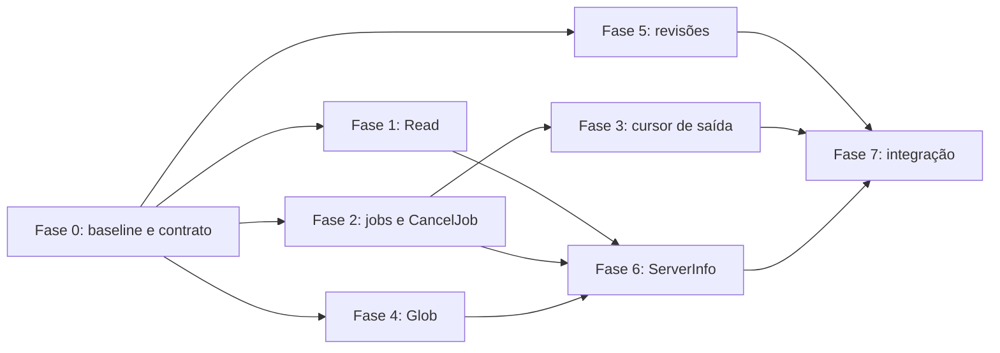

# Plano de melhorias das ferramentas MCP

## Objetivo

Melhorar segurança, previsibilidade e ergonomia das ferramentas do Code Harness sem
renomear contratos existentes nem exigir migração imediata dos clientes MCP.

O trabalho cobre:

- esclarecer o limite de segurança de `Shell`;
- tornar `Read` seguro e correto para arquivos grandes;
- completar o ciclo de vida de jobs com cancelamento, limites e saída incremental;
- garantir que `Glob` realmente entregue os arquivos mais recentes;
- permitir a descoberta de revisões anteriores;
- expor capacidades e limites do servidor sem criar uma ferramenta separada apenas
  para diagnóstico.

## Status

| Campo | Valor |
|---|---|
| Estado geral | Em andamento |
| Fase atual | — |
| Próxima fase | Fase 6 — Capacidades no `ServerInfo` |
| Última atualização | 2026-09-25 |

### Fases

| Fase | Nome | Status | Resultado principal |
|---|---|---|---|
| 0 | Baseline e contrato de segurança | concluída | Contrato host-level de `Shell` documentado; baseline registrado |
| 1 | Leitura limitada e transparente | concluída | `Read` correto para texto e imagens grandes |
| 2 | Controle do ciclo de vida de jobs | concluída | `CancelJob`, limites e retenção previsível |
| 3 | Saída incremental de jobs | concluída | Cursor opaco sem repetição de logs em `GetJobStatus` |
| 4 | Ordenação correta do `Glob` | concluída | Top 1.000 global realmente ordenado por modificação |
| 5 | Descoberta de revisões | concluída | `ListPatchReviews` compacto e isolado por projeto |
| 6 | Capacidades no `ServerInfo` | pendente | Dependências, limites e tools habilitadas descobríveis |
| 7 | Integração, hardening e release | pendente | Contratos, segurança, documentação e suíte final validados |

Status admitidos: `pendente` | `em andamento` | `concluída` | `bloqueada` |
`cancelada`.

## Decisões de projeto

### Compatibilidade

- Manter nomes e parâmetros obrigatórios das ferramentas atuais.
- Parâmetros e campos novos serão opcionais ou aditivos.
- `Read` manterá o formato textual atual para arquivos pequenos.
- `GetJobStatus` sem cursor manterá o comportamento atual de retornar o final do log.
- As tools novas poderão ser removidas da superfície com a allowlist existente.
- A entrega deve ser publicada como versão minor, pois adiciona tools, parâmetros e
  estados sem remover contratos existentes.

### Limite de segurança de `Shell`

`PathGuard` protege os caminhos recebidos diretamente por `Read`, `Write`, `Grep`,
`Glob` e ferramentas de alteração. Ele não transforma um processo de shell em uma
sandbox de sistema operacional. O comando executado pode acessar tudo que o usuário do
processo do Code Harness puder acessar.

A primeira entrega deve corrigir esse contrato na documentação e apresentar `Shell`
como capacidade privilegiada protegida por `code.exec` e pela allowlist. Não será
implementado um analisador de comandos para tentar detectar caminhos: shells permitem
expansão, subprocessos, redirecionamento e chamadas indiretas, portanto esse mecanismo
criaria uma falsa fronteira de segurança.

Isolamento real de sistema operacional poderá ser um projeto separado, com backends
específicos por plataforma e comportamento fail-closed. Ele não é requisito para as
fases abaixo.

### Novas ferramentas

Serão adicionadas somente duas tools:

| Tool | Justificativa | OAuth |
|---|---|---|
| `CancelJob` | Completa uma operação iniciada por `Shell`; não há equivalente atual | `code.exec` |
| `ListPatchReviews` | Permite reencontrar grupos persistidos após perda de contexto | `code.read` |

O diagnóstico de ambiente será incorporado a `ServerInfo`, evitando uma terceira tool.

### Limites iniciais recomendados

| Limite | Default | Configuração sugerida |
|---|---:|---|
| Jobs simultâneos por projeto | 8 | `CODE_HARNESS_JOBS_MAX_RUNNING` |
| Jobs concluídos retidos por projeto | 100 | `CODE_HARNESS_JOBS_MAX_RETAINED` |
| Retenção máxima de job concluído | 24 horas | `CODE_HARNESS_JOBS_RETENTION_SECONDS` |
| Saída por resposta incremental | 64 KiB | constante interna já alinhada a `TAIL_MAX_BYTES` |
| Imagem lida por `Read` | 4 MiB | constante compartilhada com `ShowImage` |

Valores inválidos de configuração devem impedir a inicialização com mensagem clara. Um
job em execução nunca pode ser removido pela política de retenção.

## Fase 0 — Baseline e contrato de segurança

### Implementação

1. Registrar o resultado de `pytest`, `ruff` e `mypy` antes das alterações.
2. Corrigir a afirmação geral de confinamento no `README.md`:
   - ferramentas de arquivo ficam confinadas ao projeto;
   - `Shell` executa com as permissões do processo hospedeiro;
   - endpoints remotos devem controlar `Shell` com autenticação, scope `code.exec` e
     `--tool-allowlist`.
3. Repetir o contrato na referência de tools e na arquitetura.
4. Incluir um exemplo de perfil somente leitura sem `Shell`.
5. Documentar que saída de comandos e nomes de arquivos são dados não confiáveis.

### Arquivos previstos

- `README.md`
- `docs/tools.md`
- `docs/architecture.md`
- `CHANGELOG.md`

### Critérios de aceite

- Nenhuma documentação afirma que `Shell` está confinado pelo `PathGuard`.
- O exemplo somente leitura inclui apenas tools compatíveis com `code.read` e
  `ServerInfo`.
- Não há mudança de comportamento nesta fase.

### Checkpoint da Fase 0 — 2026-09-24

- Arquivos alterados: `README.md`, `docs/tools.md`, `docs/architecture.md`,
  `src/code_harness/mcp/server.py`, `CHANGELOG.md` e este plano.
- Decisão: `Shell` permanece deliberadamente com as permissões do usuário
  hospedeiro para permitir edição e automação amplas. O projeto restringe somente
  o diretório de trabalho inicial. Autenticação, scope `code.exec`, allowlist e as
  permissões do sistema operacional controlam quem recebe essa capacidade.
- Segurança: não será criado parser ou filtro textual de comandos como fronteira
  de acesso. O perfil somente leitura omite `Shell`, `GetJobStatus` e `CancelJob`; isolamento
  real deve usar conta dedicada ou container.
- Baseline `pytest`: a `.venv` aponta para um Python 3.12 removido. Com Python
  3.12.14 do runtime do Codex, packages da `.venv` e `--basetemp` dentro do
  workspace, o resultado foi `284 passed, 10 failed, 3 warnings`. As falhas se
  concentram em ApplyPatch/review, buscas `include_all`, importação em subprocesso
  e CLI Shell sob esse runtime alternativo.
- Baseline `ruff check .`: 5 violações preexistentes (`I001`, `E501`, duas
  `RUF100` e `SIM105`).
- Baseline `mypy`: 2 erros preexistentes em `src/code_harness/ripgrep.py`, ambos
  relacionados a `stdout`/`stderr` opcionais de `Popen`.
- Verificação da fase: 2 testes focados de registro e schema MCP passaram;
  `ruff check src/code_harness/mcp/server.py` e `git diff --check` passaram. A
  busca pelas antigas garantias gerais de confinamento não encontrou ocorrências.
- Desvio: as instruções MCP em `server.py` também foram corrigidas porque fazem
  parte do contrato apresentado ao agente. Nenhum comportamento executável foi
  alterado.
- Pendência: restaurar ou recriar a `.venv` antes de usar seus entrypoints
  diretamente e tratar os gates preexistentes em trabalho separado das fases.

## Fase 1 — Leitura limitada e transparente

### Implementação

1. Separar limites de texto e imagem em constantes nomeadas e compartilháveis.
2. Consultar o tamanho da imagem antes de carregar seus bytes e rejeitar arquivos acima
   de 4 MiB com `invalid_argument` e tamanho observado.
3. Para texto, preservar o resultado atual em arquivos pequenos e acrescentar uma nota
   inequívoca quando a janela de 2 MB truncar conteúdo.
4. Corrigir offsets negativos para que contem a partir do fim real do arquivo, inclusive
   quando ele ultrapassar 2 MB.
5. Ler apenas a janela necessária quando `offset` e `limit` permitirem; evitar carregar o
   arquivo inteiro apenas para devolver poucas linhas.
6. Detectar conteúdo binário não suportado e retornar um erro claro em vez de renderizar
   bytes arbitrários como Windows-1252.
7. Atualizar a descrição MCP e a referência com os limites reais de cada tipo.

### Arquivos previstos

- `src/code_harness/tools/read.py`
- `src/code_harness/encoding.py`, se a leitura incremental exigir suporte comum
- `src/code_harness/mcp/server.py`
- `tests/test_file_tools.py`
- `tests/test_server_and_cli.py`
- `docs/tools.md`

### Critérios de aceite

- Texto pequeno mantém exatamente o formato atual.
- Texto acima de 2 MB nunca parece completo quando foi truncado.
- `offset=-N` devolve as últimas `N` linhas do arquivo real.
- Imagem acima de 4 MiB falha antes de `read_bytes()`.
- Binário desconhecido retorna erro estável.
- Os testes cobrem UTF-8, BOM, Windows-1252, CRLF, arquivo sem newline final e limite
  cortando um caractere multibyte.

### Checkpoint da Fase 1 — 2026-09-24

- Arquivos alterados: `src/code_harness/tools/read.py`,
  `src/code_harness/mcp/image_card.py`, `src/code_harness/mcp/server.py`,
  `tests/test_file_tools.py`, `README.md`, `docs/tools.md`, `CHANGELOG.md` e este
  plano.
- Texto pequeno preserva o formato anterior. Texto grande usa leitura incremental,
  recebe uma nota explícita quando a janela de 2.000.000 bytes é cortada e não
  produz caractere UTF-8 corrompido no limite.
- `offset` negativo percorre o arquivo com memória limitada e conta a partir do
  fim real. Essa operação necessariamente varre o arquivo inteiro.
- `Read` e `ShowImage` compartilham o limite público de 4 MiB por imagem. A leitura
  também é limitada depois da consulta de tamanho para cobrir crescimento
  concorrente do arquivo.
- Binários com byte NUL ou alta densidade de controles são rejeitados. A detecção
  é heurística e o tipo de imagem continua baseado na extensão.
- Verificação isolada do agente: 38 testes de arquivo/encoding e 4 testes de
  integração MCP passaram; Ruff e `git diff --check` passaram.

## Fase 2 — Controle do ciclo de vida de jobs

### Contrato de `CancelJob`

Parâmetros:

| Parâmetro | Tipo | Regra |
|---|---|---|
| `job_id` | string | obrigatório, opaco |
| `project` | string | opcional; segue a resolução atual por projeto |

Resultado estruturado:

```json
{
  "job_id": "job-...",
  "status": "cancelled",
  "exit_code": null,
  "elapsed_ms": 1234,
  "already_finished": false
}
```

Chamadas repetidas devem ser idempotentes. Um job concluído mantém seu estado e responde
`already_finished=true`; um identificador ausente responde `status="unknown"`.

### Implementação

1. Registrar cancelamento como estado explícito de `ShellJob`; não inferir cancelamento
   a partir do exit code do processo.
2. Encerrar a árvore de processos usando os caminhos já usados por `cleanup()` em Windows
   e sistemas POSIX.
3. Adicionar `CancelJob` às exports, ao MCP, à allowlist e ao scope `code.exec`.
4. Aplicar limite configurável de jobs simultâneos antes do `Popen`.
5. Podar jobs concluídos por idade e quantidade durante operações do registro.
6. Remover o arquivo de log junto com a entrada podada.
7. Preservar isolamento: o `job_id` será consultado somente no `JobRegistry` do projeto
   selecionado.

### Arquivos previstos

- `src/code_harness/shell/background.py`
- novo `src/code_harness/tools/cancel_job.py`
- `src/code_harness/tools/__init__.py`
- `src/code_harness/mcp/server.py`
- `src/code_harness/mcp/tool_policy.py`
- `src/code_harness/cli.py`
- `tests/test_shell.py`
- `tests/test_server_and_cli.py`
- `tests/test_mcp_security.py`
- `docs/tools.md`

### Critérios de aceite

- Cancelar interrompe também subprocessos em Windows e POSIX.
- Cancelar duas vezes não gera erro nem muda um estado terminal.
- `GetJobStatus` reconhece `cancelled`.
- Atingir o limite simultâneo gera erro antes de criar processo ou log.
- A poda não remove jobs em execução.
- Um projeto não consegue consultar ou cancelar job de outro projeto.
- `ReloadProjects` continua bloqueando a retirada de uma sessão com job ativo.

### Checkpoint da Fase 2 — 2026-09-25

- Arquivos alterados: `src/code_harness/shell/background.py`,
  `src/code_harness/tools/shell.py`, `src/code_harness/tools/get_job_status.py`,
  novo `src/code_harness/tools/cancel_job.py`, `src/code_harness/tools/__init__.py`,
  `src/code_harness/mcp/server.py`, `src/code_harness/mcp/tool_policy.py`, testes,
  documentação e este plano.
- `CancelJob` registra `cancelled` como estado terminal explícito, mantém
  `exit_code=null` e responde de forma idempotente por `already_finished`.
  Jobs que já terminaram preservam `completed` ou `failed`; ids ausentes ou
  removidos pela retenção retornam `unknown`.
- O Windows usa a árvore de `taskkill` e um fallback nativo por snapshot de
  processos para encerrar descendentes do mesmo job. POSIX encerra o grupo de
  processos com `SIGTERM` e, após o período de graça, `SIGKILL`.
- A reserva atômica de capacidade ocorre antes de criar o processo ou o arquivo
  de log. Defaults por projeto: 8 jobs em execução, 100 concluídos retidos e
  86.400 segundos de retenção. Configuração inválida impede a inicialização sem
  criar o diretório temporário.
- A poda roda durante operações do registro e ao término de processos. Ela
  remove entrada e log juntos e nunca seleciona jobs em execução.
- Isolamento validado: consultar ou cancelar pelo projeto incorreto retorna
  `unknown` e não altera o job do projeto proprietário. A proteção já existente
  de `ReloadProjects` contra sessões com job ativo foi preservada.
- Desvio do plano: não foi criado comando `cancel-job` no CLI. Cada comando do
  CLI abre e encerra uma `Session` própria, portanto não consegue alcançar o
  registro em memória de outro processo; expor esse comando sempre retornaria
  `unknown`. A capacidade fica na API interna e no MCP persistente, onde o
  `job_id` é válido.
- Validação: suíte completa com `316 passed` e um aviso de depreciação
  preexistente do Starlette; `mypy src` aprovou 57 arquivos; Ruff aprovou todos
  os arquivos da fase. O Ruff global conserva as duas pendências preexistentes
  em `mcp-claude-test.py` (`I001`) e `src/code_harness/errors.py` (`E501`).
  `git diff --check` passou, somente com avisos locais de LF para CRLF.

## Fase 3 — Saída incremental de jobs

### Contrato

Adicionar `cursor` opcional a `GetJobStatus`. Sem cursor, a resposta continuará trazendo
`last_output`, como hoje. Com cursor, a resposta incluirá:

```json
{
  "output": "somente conteúdo novo",
  "next_cursor": "cursor-opaco",
  "has_more_output": false
}
```

O cursor será opaco para permitir que a implementação trate posição em bytes e limites
de caracteres multibyte sem fixar esse detalhe na API pública.

### Implementação

1. Criar leitura incremental limitada a 64 KiB por chamada.
2. Nunca cortar uma sequência UTF-8 no resultado; bytes inválidos continuam usando a
   política atual de substituição.
3. Retornar `has_more_output=true` quando ainda houver bytes disponíveis após o limite.
4. Validar que o cursor pertence ao mesmo job e detectar cursor inválido ou expirado.
5. Manter `tail_lines` somente no modo sem cursor para evitar semântica ambígua.
6. Documentar que a remoção por retenção invalida cursores antigos.

### Arquivos previstos

- `src/code_harness/shell/background.py`
- `src/code_harness/tools/get_job_status.py`
- `src/code_harness/mcp/server.py`
- `tests/test_shell.py`
- `tests/test_server_and_cli.py`
- `docs/tools.md`

### Critérios de aceite

- Polls sucessivos não repetem saída.
- Um log acima de 64 KiB pode ser drenado por várias chamadas sem perda.
- Escrita parcial de caractere multibyte entre duas chamadas não produz texto corrompido.
- Chamadas antigas, sem cursor, mantêm o resultado atual.

### Checkpoint da Fase 3 — 2026-09-25

- Arquivos alterados: `src/code_harness/shell/background.py`,
  `src/code_harness/tools/get_job_status.py`, `src/code_harness/mcp/server.py`,
  `tests/test_shell.py`, `tests/test_server_and_cli.py`, `README.md`,
  `docs/tools.md`, `docs/architecture.md`, `CHANGELOG.md` e este plano.
- O modo incremental começa com o marcador público `cursor="start"`. A resposta
  entrega `output`, `next_cursor` e `has_more_output`; chamadas seguintes usam o
  cursor retornado e não repetem bytes já consumidos.
- Cada cursor é um token opaco assinado com HMAC, vinculado ao `job_id` e à
  instância do registro. Alteração, uso em outro job, reinício do servidor ou
  poda por retenção fazem a validação falhar com `invalid_argument`.
- A posição interna usa bytes. O leitor limita cada resposta a 64 KiB e retém
  temporariamente um sufixo UTF-8 incompleto, evitando texto corrompido quando o
  processo divide um caractere entre escritas. Sequências inválidas completas
  usam o caractere de substituição.
- Compatibilidade: omitir `cursor` preserva os campos `last_output` e
  `output_truncated`. `tail_lines` só pode ser personalizado nesse modo.
- Testes focados: 51 passaram, incluindo saída concorrente, log maior que 64
  KiB, UTF-8 parcial, bytes inválidos, adulteração, vínculo ao job, expiração e
  schema MCP.
- Validação completa: `324 passed` e um aviso de depreciação preexistente do
  Starlette; `mypy src` aprovou 57 arquivos; Ruff aprovou todos os arquivos da
  fase. O Ruff global conserva somente as duas pendências preexistentes em
  `mcp-claude-test.py` (`I001`) e `src/code_harness/errors.py` (`E501`).
  `git diff --check` passou, apenas com os avisos locais de LF para CRLF.

## Fase 4 — Ordenação correta do `Glob`

### Implementação

1. Fazer o ripgrep ordenar globalmente por data de modificação em ordem decrescente antes
   de o harness limitar a resposta a 1.001 entradas.
2. Preferir a ordenação nativa `--sortr modified`; validar sua disponibilidade e emitir
   erro claro quando a versão instalada não oferecer o recurso.
3. Substituir a ordenação Python do primeiro subconjunto por um coletor limitado que
   consome a saída completa e aplica o caminho como desempate determinístico.
4. Manter o limite de 1.000 resultados e o aviso de que existem mais correspondências.
5. Documentar que a ordenação global pode exigir a varredura completa da árvore.

### Arquivos previstos

- `src/code_harness/tools/search_core.py`
- `src/code_harness/ripgrep.py`, se for necessária validação de capacidade
- `tests/test_search_tools.py`
- `docs/tools.md`

### Critérios de aceite

- Com mais de 1.000 arquivos, um arquivo mais recente emitido depois dos primeiros 1.001
  candidatos aparece no resultado final.
- A lista permanece determinística quando mtimes empatam; o caminho é o desempate.
- O consumo de memória do processo continua limitado.
- O texto da resposta e os parâmetros MCP não mudam.

### Checkpoint da Fase 4 — 2026-09-24

- Arquivos alterados: `src/code_harness/ripgrep.py`,
  `src/code_harness/tools/search_core.py`, `tests/test_search_tools.py`,
  `src/code_harness/mcp/server.py`, `README.md`, `docs/tools.md`,
  `docs/architecture.md`, `CHANGELOG.md` e este plano.
- `Glob` usa `rg --sortr modified` e aplica caminho normalizado como desempate.
  O coletor consome a saída completa e mantém somente o top 1.001, o que limita
  a memória do MCP e preserva o aviso de truncamento acima de 1.000 resultados.
- Uma versão de ripgrep sem `--sortr` recebe erro que orienta sua atualização.
- Verificação isolada do agente: 35 testes de busca passaram, incluindo árvore
  real com 1.002 arquivos, empate de `mtime` e melhor candidato após o limite;
  Ruff, mypy e `git diff --check` passaram.
- Risco residual: a ordenação global faz o subprocesso do ripgrep percorrer e
  ordenar toda a árvore em uma thread, elevando a latência em árvores muito grandes.

### Validação conjunta das Fases 1 e 4 — 2026-09-24

- Suíte completa: `303 passed`, com um aviso de depreciação preexistente do
  Starlette. O runtime alternativo foi incluído no `PATH` e `src` no `PYTHONPATH`
  porque a `.venv` ainda referencia um Python removido.
- `mypy src`: 56 arquivos analisados sem erros.
- Ruff dos arquivos alterados nas duas fases: aprovado. O Ruff do repositório
  conserva duas pendências preexistentes fora do escopo, em `mcp-claude-test.py`
  (`I001`) e `src/code_harness/errors.py` (`E501`).
- `git diff --check`: aprovado; os únicos avisos são a conversão futura de LF
  para CRLF configurada pelo Git local.

## Fase 5 — Descoberta de revisões

### Contrato de `ListPatchReviews`

| Parâmetro | Tipo | Regra |
|---|---|---|
| `limit` | int | default 20; mínimo 1, máximo 100 |
| `status` | enum | `all`, `pending`, `reviewed`, `rolled_back`; default `all` |
| `project` | string | opcional; segue a resolução atual |

Cada item deve ser compacto e conter apenas:

- `group_id` e título;
- criação e última atualização;
- número de patches e arquivos;
- contagens `pending`, `reviewed` e `rolled_back`;
- último `transaction_id` para uso com `OpenPatchReview`.

Diferenças completas e snapshots não devem ser incluídos na listagem.

### Implementação

1. Reutilizar `ReviewService.list_groups()` e adicionar filtro sem duplicar leitura de
   manifests.
2. Registrar a tool como read-only, idempotente e `code.read`.
3. Garantir que a resolução ocorra dentro de uma lease do projeto.
4. Adicionar o comando CLI equivalente para inspeção manual.
5. Atualizar instruções MCP para orientar o fluxo
   `ListPatchReviews -> OpenPatchReview`.

### Arquivos previstos

- `src/code_harness/review/service.py`
- novo `src/code_harness/tools/list_patch_reviews.py`, se a adaptação não couber no MCP
- `src/code_harness/tools/__init__.py`
- `src/code_harness/mcp/server.py`
- `src/code_harness/mcp/tool_policy.py`
- `src/code_harness/cli.py`
- `tests/test_review_integration.py`
- `tests/test_server_and_cli.py`
- `tests/test_mcp_security.py`
- `docs/tools.md`

### Critérios de aceite

- Uma sessão nova consegue descobrir uma revisão persistida e abrir seu URL.
- Filtros e limite são aplicados depois de uma ordenação determinística por atualização.
- Nenhum item expõe root absoluto, caminho de snapshot ou conteúdo integral de diff.
- Projetos nomeados não enxergam revisões uns dos outros.

### Checkpoint da Fase 5 — 2026-09-25

- Arquivos alterados: `src/code_harness/review/service.py`, novo
  `src/code_harness/tools/list_patch_reviews.py`, exports, CLI, política MCP,
  servidor, testes, documentação e este plano.
- `ListPatchReviews` aceita `limit` de 1 a 100, filtro `all`, `pending`,
  `reviewed` ou `rolled_back` e o seletor opcional de projeto. O filtro inclui
  grupos que contenham ao menos uma atualização no estado escolhido e é aplicado
  antes do limite.
- A resposta expõe somente ids, título, timestamps, contagens e o último
  `transaction_id`. Caminhos alterados, descrições, diffs, snapshots, roots e
  ids internos de workspace ficam fora do contrato.
- A ordenação usa `updated_at` decrescente e `group_id` como desempate estável.
  A resolução MCP ocorre dentro da lease da sessão selecionada; a tool é marcada
  read-only e idempotente e exige OAuth `code.read`.
- O comando `code-harness list-patch-reviews` reutiliza o mesmo contrato e
  permite inspeção manual sem iniciar o portal local.
- Validação focada: 21 testes passaram, cobrindo persistência entre
  sessões, reabertura, filtros, limites, contrato compacto, CLI, schema, scope e
  isolamento entre projetos.
- Validação completa: `332 passed` e um aviso de depreciação preexistente do
  Starlette; `mypy src` aprovou 58 arquivos; Ruff aprovou todos os arquivos da
  fase. O Ruff global conserva somente as duas pendências preexistentes em
  `mcp-claude-test.py` (`I001`) e `src/code_harness/errors.py` (`E501`).
  `git diff --check` passou, apenas com avisos locais de LF para CRLF.

## Fase 6 — Capacidades no `ServerInfo`

### Contrato aditivo

Manter `name`, `version` e `platform` e acrescentar:

```json
{
  "capabilities": {
    "ripgrep": true,
    "git": true,
    "reference_parsers": ["python", "java", "javascript", "typescript"]
  },
  "limits": {
    "read_text_bytes": 2000000,
    "read_image_bytes": 4194304,
    "max_running_jobs_per_project": 8
  },
  "enabled_tools": ["..."]
}
```

### Implementação

1. Detectar disponibilidade sem executar projetos nem retornar caminhos dos executáveis.
2. Derivar `enabled_tools` da política efetivamente aplicada ao servidor.
3. Expor somente limites operacionais úteis ao cliente.
4. Manter `ServerInfo` seguro para endpoint público: nada de roots, variáveis de ambiente,
   tokens, URLs internas ou conteúdo de configuração.
5. Não afirmar suporte a card visual no cliente; isso depende do host MCP e não pode ser
   comprovado pelo servidor.

### Arquivos previstos

- `src/code_harness/mcp/server.py`
- `src/code_harness/mcp/tool_policy.py`
- módulos de descoberta de Git, ripgrep e parsers
- `tests/test_server_and_cli.py`
- `tests/test_mcp_security.py`
- `docs/tools.md`

### Critérios de aceite

- O resultado permite ao agente prever se `Grep`, `ApplyPatch` e referências funcionarão.
- A resposta não contém caminhos absolutos ou segredos.
- Clientes que leem somente os três campos atuais continuam funcionando.
- A lista reflete a allowlist real, inclusive quando só `ServerInfo` está exposto.

## Fase 7 — Integração, hardening e release

### Trabalho final

1. Adicionar `ToolAnnotations` coerentes às tools novas:
   - `CancelJob`: destrutiva, não read-only, idempotente;
   - `ListPatchReviews`: read-only, idempotente, sem acesso aberto à rede.
2. Validar schemas MCP e descrições em uma única matriz de contrato.
3. Validar allowlist, scopes OAuth e o endpoint público sem autenticação.
4. Exercitar stdio e Streamable HTTP nos modos legado e multi-project.
5. Atualizar README, referência, arquitetura, changelog e contagem de tools.
6. Rodar a suíte completa e registrar o resultado no checkpoint da fase.

### Gates obrigatórios

```text
pytest
ruff check .
mypy
```

Além dos gates gerais:

- teste de cancelamento de árvore de processos em Windows e POSIX;
- teste de arquivo de texto e imagem acima dos limites;
- teste real de `Glob` com mais de 1.000 arquivos;
- teste de cursor com escrita concorrente no log;
- teste de isolamento de jobs e reviews entre dois projetos;
- teste de cada nova tool sob allowlist e OAuth.

### Critérios de aceite

- Todos os gates passam sem reduzir cobertura, excluir testes ou adicionar suppressions.
- A documentação corresponde ao schema retornado pelo servidor.
- O changelog identifica os campos e tools novos e a correção do contrato de `Shell`.
- Não há regressão nos fluxos atuais sem os novos parâmetros.

## Ordem de execução e dependências



Depois da Fase 0, as fases 1, 2, 4 e 5 são independentes. A Fase 3 depende do novo
ciclo de vida de jobs, e `ServerInfo` deve ser finalizado depois que limites e tools
estiverem definidos.

## Checkpoint obrigatório por fase

Ao concluir cada fase, registrar abaixo da própria seção:

- data;
- arquivos alterados;
- decisões tomadas;
- testes executados e resultados;
- desvios do plano;
- riscos ou pendências restantes.

O status documental não substitui a verificação no código e nos testes.

## Fora de escopo

- parser ou allowlist textual de comandos de shell como fronteira de segurança;
- sandbox de sistema operacional multiplataforma;
- persistência de jobs após reinício do servidor;
- streaming MCP por notificações push; o modelo desta entrega continua sendo polling;
- listagem completa de diffs em `ListPatchReviews`;
- índice de arquivos ou banco de dados para busca;
- renomear `Grep`, `Glob`, `Read`, `Shell` ou `GetJobStatus`.
