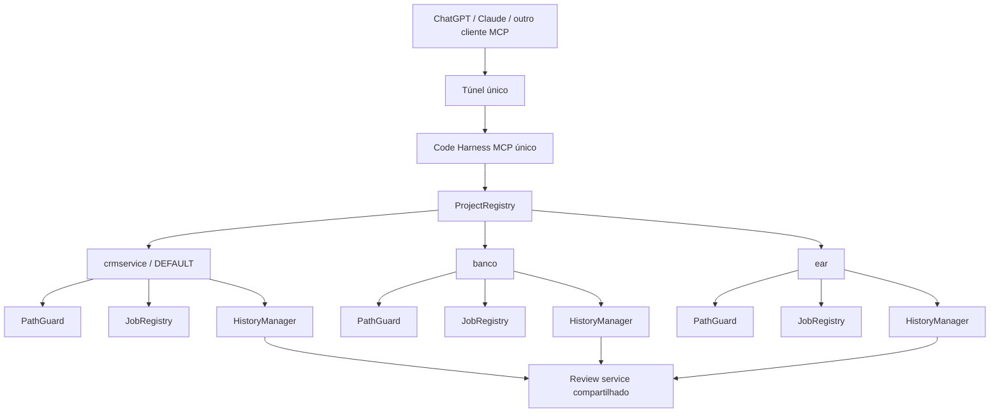

# Multi-project workspaces no Code Harness

## Objetivo

Permitir que uma única instância do Code Harness / MCP exponha vários projetos simultaneamente, mantendo:

- um único processo MCP;
- um único endpoint/túnel;
- um projeto `default` para preservar o uso atual;
- seleção explícita de projeto por chamada quando necessário;
- isolamento de paths, jobs, histórico, patches, rollback e reviews entre projetos;
- compatibilidade com clientes que não enviam o parâmetro `project`.

A motivação principal é eliminar o ciclo atual de derrubar servidor/túnel, alterar `CODE_HARNESS_PROJECT`, subir novamente e reconectar o cliente apenas para trocar o projeto utilizado.

---

## Status

| Campo | Valor |
|-------|-------|
| Estado geral | Concluído |
| Fase atual | — |
| Última fase concluída | Fase 9 — Hardening, compatibilidade e testes finais |
| Próxima fase | — |
| Última atualização | 2026-08-17 |

### Fases

| Fase | Nome | Status | Notas |
|------|------|--------|-------|
| 0 | Levantamento e decisão arquitetural | concluída | arquitetura atual analisada; abordagem Registry + aliases + default escolhida |
| 1 | ProjectRegistry e sessões por projeto | concluída | `ProjectRegistry` criado; `Session` reaproveitada por alias; MCP/CLI ainda inalterados |
| 2 | Configuração multi-project + default | concluída | `serve` aceita `alias=path` repetível + `--default-project`; modo legado preservado |
| 3 | Parâmetro `project` nas tools MCP | concluída | 8 tools project-aware; resolução por request; default preservado; jobs/review/rollback seguem fases próprias |
| 4 | Jobs multi-project | concluída | `GetJobStatus` project-aware; consulta exatamente um `JobRegistry`; sem busca global por `job_id` |
| 5 | History / patch / rollback multi-project | concluída | `RollbackPatch` project-aware; manifests validam workspace; patches/histories isolados por projeto |
| 6 | Review portal compartilhado | concluída | `ReviewHub` único por registry; portal agrega workspaces; `OpenPatchReview` project-aware |
| 7 | ListProjects / ProjectInfo e identificação de contexto | concluída | aliases/default descobertos sem root; metadata `project` em resultados estruturados de execução/mutação/review |
| 8 | Configuração persistente + ReloadProjects | concluída | TOML persistente + reload transacional; sessões estáveis reutilizadas; remoções inseguras bloqueadas |
| 9 | Hardening, compatibilidade e testes finais | concluída | matriz final validada; HTTP reproduzível; docs principais atualizadas; suíte completa verde |

Statuses admitidos: `pendente` | `em andamento` | `concluída` | `bloqueada` | `cancelada`.

### Como atualizar este documento

Ao **iniciar uma fase**:

1. `Estado geral` -> `Em andamento`;
2. `Fase atual` -> número e nome da fase;
3. status da linha -> `em andamento`;
4. registrar no bloco **Handoff da implementação** quem/que alteração iniciou a fase, se relevante.

Ao **concluir uma fase**:

1. status da linha -> `concluída`;
2. `Última fase concluída` -> fase concluída;
3. `Próxima fase` -> fase seguinte;
4. `Fase atual` -> `—` se nenhum trabalho da próxima fase começou;
5. `Última atualização` -> data da conclusão;
6. preencher obrigatoriamente o checkpoint da fase com arquivos alterados, decisões, testes executados e pendências.

**Regra importante:** nenhuma LLM/agente deve inferir que uma fase foi implementada somente porque ela está descrita neste plano. O status da tabela e o checkpoint correspondente são a fonte de verdade documental. O código e os testes continuam sendo a fonte de verdade técnica.

---

## Estado atual antes da implementação

A arquitetura atual trabalha com **um projeto por `Session`**.

Pontos confirmados no código durante a Fase 0:

- `src/code_harness/session.py`
  - `Session` contém `PathGuard`, `JobRegistry`, `HistoryManager` e `ReviewManager`;
  - `Session.create(project)` resolve apenas um root;
  - resolução atual: argumento -> `CODE_HARNESS_PROJECT` -> diretório corrente.
- `src/code_harness/cli.py`
  - `--project/-p` representa um único diretório;
  - CLI e servidor MCP recebem um único projeto.
- `src/code_harness/mcp/server.py`
  - uma única `Session` é criada;
  - as tools fecham diretamente sobre `session.guard`, `session.jobs`, `session.history` e `session.reviews`.
- `src/code_harness/history.py`
  - já existe separação por `workspace_id` derivado do path do projeto;
  - manifests já registram `workspace_id` e `workspace_root`;
  - isso deve ser reaproveitado, não substituído.
- `src/code_harness/review/manager.py`
  - atualmente existe um portal local por `Session`;
  - usa por padrão `127.0.0.1:8765`;
  - múltiplas `Session`s criadas ingenuamente causariam disputa pela mesma porta.

Nenhuma alteração de implementação multi-project foi feita até este checkpoint.

---

## Decisão arquitetural

### Escolhida: Registry + aliases + projeto default

A arquitetura alvo é:



Cada projeto deve possuir um alias estável, por exemplo:

```text
crmservice -> H:\NBS\39317\FREEDOM\crmservice
banco      -> H:\NBS\39338\BANCO_DE_DADOS
ear        -> H:\Projetos\ear
```

Um deles é o projeto default:

```text
default_project = crmservice
```

### Regra de resolução

Toda operação project-aware deve seguir:

```text
project informado?
    sim -> resolver alias exato
    não -> usar default_project
```

Alias inexistente deve retornar erro claro. **Nunca** deve cair silenciosamente no projeto default.

### Não implementar como estado global mutável

Não criar comportamento do tipo:

```text
SetActiveProject("banco")
```

como mecanismo principal de roteamento.

Motivo: dois chats/clientes concorrentes poderiam trocar o projeto global entre chamadas e provocar leitura ou mutação no workspace errado.

A seleção deve ser **por request**, não por estado global.

---

## Alternativas avaliadas

| Alternativa | Decisão | Motivo |
|-------------|---------|--------|
| Um MCP/porta/túnel por projeto | rejeitada | mantém o problema operacional atual e multiplica processos/conectores |
| Subir um diretório pai grande como único projeto | rejeitada | reduz isolamento e amplia demais a superfície permitida pelo `PathGuard` |
| Enviar path absoluto arbitrário em cada tool | rejeitada | piora segurança e permite roots não previamente autorizados |
| `SetActiveProject` global | rejeitada | risco de corrida entre clientes/chats concorrentes |
| Registry de projetos nomeados + default | escolhida | isolamento, um único endpoint e compatibilidade com uso atual |
| Adição dinâmica de qualquer path via MCP | adiada | útil, mas deve vir depois com allowlist de roots autorizados |

---

# Fases de implementação

## Fase 0 — Levantamento e decisão arquitetural

**Status:** concluída (2026-08-17)

### Entregue

- levantamento do vínculo atual `Session -> um projeto`;
- identificação dos impactos em MCP, CLI, jobs, history e review;
- confirmação de que `HistoryManager` já trabalha com identidade de workspace;
- identificação do conflito de porta do `ReviewManager` para múltiplas sessões;
- escolha da arquitetura `ProjectRegistry + aliases + default`;
- definição de seleção por request em vez de estado global.

### Arquivos analisados

- `src/code_harness/session.py`
- `src/code_harness/cli.py`
- `src/code_harness/mcp/server.py`
- `src/code_harness/history.py`
- `src/code_harness/review/manager.py`
- `docs/architecture.md`

### Código alterado

Nenhum código funcional alterado nesta fase. Apenas este documento de planejamento/handoff foi criado.

### Critério de pronto

Concluído quando a arquitetura alvo, riscos e ordem de implementação estiverem documentados o suficiente para outra LLM continuar sem reconstruir o raciocínio do zero.

---

## Fase 1 — ProjectRegistry e sessões por projeto

**Status:** concluída

### Objetivo

Criar o conceito interno de múltiplos projetos sem alterar ainda o contrato das tools MCP.

### Implementação esperada

Criar módulo interno, preferencialmente:

```text
src/code_harness/projects.py
```

Conceito esperado:

```python
ProjectRegistry
    projects: dict[str, ProjectSession]
    default_project: str

    resolve(project: str | None) -> ProjectSession
    list_projects() -> ...
```

A atual `Session` pode ser reaproveitada como sessão de um projeto para reduzir impacto. Renomear para `ProjectSession` só deve ocorrer se trouxer ganho real e não gerar refatoração desnecessária.

Cada projeto deve manter isolamento próprio para:

- `PathGuard`;
- `JobRegistry`;
- `HistoryManager`.

O `ReviewManager` ainda pode exigir tratamento especial e será resolvido formalmente na Fase 6.

### Compatibilidade

A criação tradicional com um único projeto deve continuar possível durante a migração.

### Testes mínimos

- registry com um projeto;
- registry com três aliases;
- resolução sem alias usa default;
- alias explícito resolve o projeto correto;
- alias inexistente gera erro;
- dois projetos com paths diferentes recebem `PathGuard` diferentes;
- histories possuem workspaces independentes.

### Critério de pronto

O código interno consegue representar e resolver vários projetos simultaneamente sem alterar ainda a superfície pública das tools MCP.

### Checkpoint da implementação

- Data: 2026-08-17
- Arquivos alterados:
  - `src/code_harness/projects.py` — novo `ProjectRegistry`;
  - `src/code_harness/session.py` — `Session.create(...)` passou a aceitar `review_port` opcional sem alterar o comportamento legado;
  - `tests/test_projects.py` — testes focados da fundação multi-project;
  - `docs/multi-project-workspaces.md` — status e handoff da fase.
- Decisões tomadas:
  - a classe `Session` existente foi mantida e passa a representar internamente a sessão isolada de um projeto; não houve renomeação para `ProjectSession`;
  - `ProjectRegistry` mantém aliases registrados em mapping somente leitura, possui `default_project`, resolve `None` para o default e nunca faz fallback de alias explícito inválido;
  - `ProjectRegistry.create(...)` cria uma `Session` independente por alias e `shutdown()` libera os recursos de todas as sessões registradas;
  - para evitar colisão imediata do `ReviewManager` antes da Fase 6, a sessão default preserva a porta/configuração de review atual e sessões adicionais criadas pelo registry usam portas efêmeras (`review_port=0`);
  - essa distribuição de portas é transitória e não substitui o review portal compartilhado planejado para a Fase 6;
  - nenhuma alteração foi feita ainda em `cli.py`, `mcp/server.py` ou no schema das tools MCP.
- Testes executados:
  - `python -m pytest tests/test_projects.py -q`;
  - `python -m ruff check src/code_harness/projects.py src/code_harness/session.py tests/test_projects.py`;
  - `python -m mypy src/code_harness/projects.py src/code_harness/session.py`;
  - `python -m pytest tests/test_projects.py tests/test_server_and_cli.py -q`.
- Resultado dos testes: lint passou; mypy passou; execução combinada terminou com 20 testes passando (5 novos de registry + 15 existentes de server/CLI).
- Pendências/riscos conhecidos: ainda existe um `ReviewManager` por `Session`. A estratégia de portas efêmeras para projetos adicionais permite a fundação multi-project funcionar sem colisão, mas o servidor compartilhado definitivo e a unificação das URLs/reviews continuam pendentes para a Fase 6.
- Próxima ação recomendada: implementar a Fase 2, fazendo CLI/configuração criarem o registry e preservando integralmente `--project <path>` como fluxo legado.

---

## Fase 2 — Configuração multi-project + default

**Status:** concluída

### Objetivo

Permitir iniciar o servidor com múltiplos projetos nomeados, preservando o formato legado.

### Compatibilidade obrigatória

O uso atual deve continuar válido:

```powershell
code-harness serve --project H:\NBS\39317\FREEDOM\crmservice
```

### Novo formato desejado

Exemplo conceitual:

```powershell
code-harness serve `
  --project crmservice=H:\NBS\39317\FREEDOM\crmservice `
  --project banco=H:\NBS\39338\BANCO_DE_DADOS `
  --project ear=H:\Projetos\ear `
  --default-project crmservice
```

A sintaxe final pode variar se Typer ou compatibilidade indicarem uma alternativa melhor, mas os seguintes conceitos são obrigatórios:

- alias;
- path;
- default explícito quando houver mais de um projeto;
- caminho legado sem alias continua funcionando.

### Validações

- aliases duplicados -> erro;
- default inexistente -> erro;
- path inválido/inacessível -> erro claro conforme comportamento atual;
- normalização de alias deve ser previsível;
- não aceitar que dois aliases ambíguos sejam resolvidos silenciosamente.

### Critério de pronto

Servidor consegue subir com um ou vários projetos registrados, mantendo um default determinado e preservando a inicialização antiga.

### Checkpoint da implementação

- Data: 2026-08-17
- Arquivos alterados:
  - `src/code_harness/projects.py`;
  - `src/code_harness/mcp/server.py`;
  - `src/code_harness/cli.py`;
  - `tests/test_projects.py`;
  - `tests/test_server_and_cli.py`;
  - `docs/multi-project-workspaces.md`.
- Sintaxe CLI final:
  - legado preservado: `code-harness serve --project <PATH>`;
  - um projeto nomeado: `code-harness serve --project alias=<PATH>`; o único alias vira default automaticamente;
  - múltiplos projetos: repetir `--project alias=<PATH>` e informar obrigatoriamente `--default-project <alias>`;
  - a mesma sintaxe vale para `code-harness mcp serve`;
  - sem `--project`, o fluxo legado continua resolvendo `CODE_HARNESS_PROJECT` e depois o diretório atual via `Session.create()`.
- Decisões tomadas:
  - `--project` é repetível somente nos entrypoints de servidor; comandos locais como `Read`, `Grep` e `Shell` continuam usando um único `--project <PATH>` nesta fase;
  - não é permitido misturar `--project <PATH>` legado com `--project alias=<PATH>`;
  - aliases recebem `strip()` de espaços externos, permanecem case-sensitive para resolução e aliases que diferem apenas por caixa (`CRM`/`crm`) são rejeitados como ambíguos;
  - `create_server(registry=...)` registra as tools atuais contra a sessão default; seleção por chamada continua fora de escopo até a Fase 3;
  - o lifecycle do MCP mantém e encerra todas as sessões do registry.
- Compatibilidade validada:
  - `--project <PATH>` continua chegando a `run_server(project=...)` sem registry;
  - inicialização sem `--project` continua usando env/cwd;
  - schemas das tools MCP não foram alterados;
  - handshake Streamable HTTP e configurações HTTP diretamente afetadas continuam funcionando.
- Testes executados:
  - `python -m pytest tests/test_projects.py tests/test_server_and_cli.py -q` -> 32 passed;
  - subset HTTP diretamente afetado (`create_server`, handshake e help de `serve`/`mcp serve`) -> 4 passed;
  - `python -m ruff check ...` nos arquivos alterados -> passou;
  - `python -m mypy src/code_harness/projects.py src/code_harness/mcp/server.py src/code_harness/cli.py` -> passou;
  - `git diff --check` nos arquivos da fase -> passou.
- Pendências/riscos conhecidos:
  - as tools ainda não aceitam `project`; até a Fase 3 todas operam no projeto default;
  - continua existindo um `ReviewManager` por sessão, com portas efêmeras para projetos adicionais até a Fase 6;
  - configuração persistente/arquivo de projetos e reload continuam reservados para a Fase 8;
  - a execução completa de `tests/test_http_serve.py` não é um gate limpo no working tree atual: existe pelo menos uma falha anterior à Fase 2 em `test_non_loopback_requires_api_key`, relacionada às alterações já existentes de segurança HTTP. O subset HTTP tocado por esta fase passou.
- Próxima ação recomendada: implementar a Fase 3, adicionando `project: str | None` às tools MCP e resolvendo a sessão por request através do `ProjectRegistry`, com fallback exclusivo para o default quando o parâmetro for omitido.

---

## Fase 3 — Parâmetro `project` nas tools MCP

**Status:** concluída

### Objetivo

Permitir que cada chamada selecione seu projeto explicitamente.

### Tools inicialmente project-aware

- `Shell`
- `Grep`
- `Glob`
- `Read`
- `Write`
- `StrReplace`
- `ApplyPatch`
- `Delete`

Avaliar `OpenPatchReview`, `RollbackPatch` e `GetJobStatus` conforme as regras específicas das Fases 4–6.

### Contrato

Adicionar:

```python
project: str | None = None
```

Sem `project`:

```text
usar default_project
```

Com `project`:

```text
resolver somente o alias informado
```

### Exemplo

```json
{
  "project": "banco",
  "pattern": "PKG_OS_AGENDA_CONSULTOR",
  "path": "."
}
```

### Segurança

O alias seleciona uma sessão já registrada. A chamada nunca recebe autoridade para definir um novo root arbitrário.

### Critério de pronto

Chamadas simultâneas para projetos diferentes usam os respectivos guards/serviços sem compartilhar root indevidamente, e clientes antigos continuam funcionando pelo default.

### Checkpoint da implementação

- Data: 2026-08-17
- Tools alteradas: `Shell`, `Grep`, `Glob`, `Read`, `Write`, `StrReplace`, `ApplyPatch` e `Delete`.
- Alterações de schema MCP:
  - as 8 tools acima receberam `project: str | None = None`;
  - ausência de `project` resolve a sessão default do `ProjectRegistry`;
  - alias explícito é resolvido somente pelo registry; alias desconhecido retorna `invalid_argument` sem fallback;
  - `GetJobStatus`, `OpenPatchReview` e `RollbackPatch` permaneceram sem `project`, conforme divisão das Fases 4–6;
  - servidor legado iniciado com um único path continua aceitando chamadas sem `project`; um alias explícito nesse modo é rejeitado, pois não existe registry de aliases configurado.
- Implementação interna:
  - `create_server()` passa o `ProjectRegistry` para `register_tools()`;
  - `register_tools()` resolve uma única `Session` por request e usa dessa sessão o `PathGuard`, `JobRegistry`, `HistoryManager` e `ReviewManager` necessários à tool;
  - as instruções MCP agora explicam quais tools aceitam alias e que omissão usa o default.
- Testes de concorrência:
  - duas chamadas `Read` simultâneas com aliases distintos foram executadas em paralelo e confirmaram roots diferentes, com sobreposição real das chamadas;
  - `Write(project="banco")` confirmou criação somente no root e history/review associados ao projeto `banco`;
  - alias inexistente foi testado e não executou a operação no default.
- Compatibilidade validada:
  - cliente antigo que omite `project` continua usando o default;
  - schemas mantêm os parâmetros anteriores e apenas acrescentam `project` opcional nas 8 tools da fase;
  - políticas MCP/OAuth e criação/handshake Streamable HTTP diretamente afetados continuam funcionando.
- Testes executados:
  - `python -m pytest tests/test_projects.py tests/test_server_and_cli.py tests/test_mcp_security.py -q` -> 43 passed;
  - subset HTTP `create_server_applies_http_settings` + `streamable_http_initialize_handshake` -> 2 passed;
  - `python -m ruff check src/code_harness/mcp/server.py tests/test_server_and_cli.py` -> passou;
  - `python -m mypy src/code_harness/mcp/server.py` -> passou;
  - `git diff --check -- src/code_harness/mcp/server.py tests/test_server_and_cli.py` -> passou.
- Pendências/riscos conhecidos:
  - `Shell(project=<não-default>)` já pode criar job no `JobRegistry` correto, mas `GetJobStatus` ainda consulta somente o default; resolver na Fase 4;
  - mutações em projeto não-default já usam history/review corretos, porém `RollbackPatch` ainda opera somente no default até a Fase 5;
  - `OpenPatchReview` ainda opera somente no review manager default; o `review_url` retornado pela própria mutação não-default continua sendo a forma direta de abrir aquele review até a Fase 6;
  - descoberta automática dos aliases disponíveis ainda não existe; `ListProjects`/`ProjectInfo` continuam previstos para a Fase 7.
- Próxima ação recomendada: implementar a Fase 4, tornando `GetJobStatus` multi-project e definindo resolução segura de `job_id` sem busca ambígua entre registries.

---

## Fase 4 — Jobs multi-project

**Status:** concluída

### Objetivo

Garantir que comandos em background permaneçam associados ao projeto correto.

### Estado desejado

```text
crmservice
  JobRegistry
    job abc123

banco
  JobRegistry
    job def456
```

### Estratégias aceitas

Preferência:

- manter `JobRegistry` por projeto;
- manter índice/roteador global mínimo `job_id -> project` somente se necessário para ergonomia;
- permitir `project` opcional em `GetJobStatus` se isso simplificar validação;
- nunca procurar um mesmo `job_id` em vários projetos de forma ambígua.

### Critério de pronto

Um job iniciado no projeto A não pode ser consultado, encerrado ou confundido com o projeto B.

### Checkpoint da implementação

- Data: 2026-08-17
- Estratégia final para `job_id`:
  - `Shell(project=<alias>)` continua registrando o processo exclusivamente no `JobRegistry` da sessão selecionada;
  - `GetJobStatus` agora aceita `project: str | None = None` e resolve exatamente uma sessão pelo mesmo `ProjectRegistry` usado pelas demais tools;
  - quando `project` é omitido, consulta somente o `JobRegistry` do projeto default;
  - quando `project` é informado, consulta somente o registry daquele alias;
  - não foi criado índice global `job_id -> project` e não existe varredura/fallback entre registries; informar o projeto errado resulta em job `unknown` naquele registry.
- Arquivos alterados:
  - `src/code_harness/mcp/server.py`;
  - `tests/test_server_and_cli.py`;
  - `docs/multi-project-workspaces.md`.
- Testes executados:
  - `python -m pytest tests/test_server_and_cli.py tests/test_projects.py tests/test_shell.py tests/test_mcp_security.py -q` -> 76 passed;
  - testes específicos confirmaram default, alias explícito, concorrência entre dois registries e ausência de busca cruzada por `job_id`;
  - `python -m ruff check src/code_harness/mcp/server.py tests/test_server_and_cli.py` -> passou;
  - `python -m mypy src/code_harness/mcp/server.py` -> passou;
  - `git diff --check -- src/code_harness/mcp/server.py tests/test_server_and_cli.py` -> passou.
- Pendências/riscos conhecidos:
  - quem cria um job em projeto não-default deve reutilizar o mesmo alias ao chamar `GetJobStatus`; descoberta automática pelo `job_id` não foi implementada intencionalmente para evitar busca ambígua;
  - `RollbackPatch` continua no projeto default até a Fase 5;
  - `OpenPatchReview` continua no review manager default até a Fase 6.
- Próxima ação recomendada: implementar a Fase 5, tornando `RollbackPatch` project-aware e validando explicitamente que transaction/group pertencem ao workspace selecionado antes de qualquer restauração.

---

## Fase 5 — History / ApplyPatch / Rollback multi-project

**Status:** concluída

### Objetivo

Reaproveitar o isolamento de workspace já existente no `HistoryManager` e garantir roteamento seguro de mutações/rollback.

### Importante

`HistoryManager` já deriva:

```text
workspace_id = hash(project_root)
```

E os manifests registram:

- `workspace_id`;
- `workspace_root`.

Não substituir esse mecanismo sem necessidade.

### Regras

- `ApplyPatch(project="crmservice")` usa exclusivamente o history do crmservice;
- rollback deve validar workspace antes da mutação;
- transaction de A + project B deve falhar claramente;
- locks continuam isolados por workspace;
- nenhuma busca global de transaction pode produzir rollback no root errado.

### Critério de pronto

Patch, grupos, snapshots e rollback permanecem byte-exact e confinados ao workspace correto com múltiplos projetos ativos simultaneamente.

### Checkpoint da implementação

- Data: 2026-08-17.
- Arquivos alterados:
  - `src/code_harness/history.py`;
  - `src/code_harness/mcp/server.py`;
  - `tests/test_apply_patch.py`;
  - `tests/test_server_and_cli.py`;
  - `docs/multi-project-workspaces.md`.
- Validação workspace/transaction implementada:
  - `HistoryManager.load()` agora valida `workspace_id` e `workspace_root` do manifest antes de devolvê-lo a qualquer consumidor;
  - manifest pertencente a outro workspace gera `PatchHistoryError` antes de leitura de snapshots/restauração;
  - `RollbackPatch` aceita `project: str | None` e usa exclusivamente o `HistoryManager` da sessão resolvida;
  - omitir `project` preserva o default; alias desconhecido continua falhando sem fallback;
  - `ApplyPatch` já era project-aware desde a Fase 3 e foi validado novamente com dois projetos em paralelo, cada um com transaction/group/history próprios.
- Testes de rollback cruzado:
  - transaction criada no workspace A e manifest copiado fisicamente para o diretório de B foi rejeitada por identidade de workspace antes de qualquer mutação;
  - teste de roteamento MCP confirmou `RollbackPatch(project="banco")` usando somente `banco.history`;
  - dois `ApplyPatch` simultâneos em projetos distintos confirmaram locks/histories/workspace IDs independentes;
  - regressões de rollback byte-exact, grupos, review e segurança MCP permaneceram verdes.
- Testes executados:
  - conjunto focado inicial (`test_server_and_cli`, `test_apply_patch`, `test_review_grouping`) -> 49 passed;
  - conjunto consolidado (`test_server_and_cli`, `test_apply_patch`, `test_history`, `test_review_grouping`, `test_review_server`, `test_review_integration`, `test_mcp_security`) -> 75 passed, 1 warning de depreciação Starlette já existente;
  - Ruff nos arquivos alterados -> passou;
  - mypy em `history.py` e `mcp/server.py` -> passou;
  - `git diff --check` -> passou.
- Pendências/riscos conhecidos:
  - `OpenPatchReview` ainda usa somente o `ReviewManager` default e continua reservado à Fase 6;
  - não foi criada busca global por transaction/group entre workspaces; o alias selecionado define exatamente qual history pode ser consultado, evitando inferência ambígua;
  - cada sessão ainda possui seu próprio servidor de review/porta temporária para projetos adicionais, conforme solução transitória da Fase 1.
- Próxima ação recomendada: implementar a Fase 6, consolidando o review portal em um serviço compartilhado que consiga resolver transactions/groups de múltiplos workspaces sem colisão de porta e sem vazamento entre projetos.

---

## Fase 6 — Review portal compartilhado

**Status:** concluída

### Problema anterior

Antes desta fase, `ReviewManager` iniciava um servidor HTTP por `Session` e usava porta local fixa por padrão (`8765`). Criar várias Sessions diretamente provocava conflito de bind; a Fase 1 usava portas efêmeras adicionais como solução transitória.

### Arquitetura implementada

Um único servidor de review para o processo MCP:

```text
ReviewServer :8765
  -> workspace crmservice
  -> workspace banco
  -> workspace ear
```

### Possível URL

```text
http://127.0.0.1:8765/?workspace=crmservice&group=...&patch=...
```

Se `group_id` / `transaction_id` forem globalmente suficientes para resolver o workspace com segurança, o parâmetro `workspace` pode ser apenas informativo. A implementação deve preferir validação explícita a inferência ambígua.

### Critério de pronto

Reviews de projetos diferentes podem ser abertos simultaneamente usando o mesmo servidor local sem colisão de porta ou vazamento de histórico entre workspaces.

### Checkpoint da implementação

- Data: 2026-08-17.
- Arquitetura final do review:
  - `ProjectRegistry.create()` cria um único `ReviewHub` para todos os aliases registrados;
  - o `ReviewHub` é dono do único servidor HTTP, `ReviewSecurity` e `SharedReviewService` do processo/registry;
  - cada `Session` mantém um `ReviewManager` leve e workspace-scoped, ligado ao mesmo hub, preservando a API usada por `Write`, `StrReplace`, `ApplyPatch` e `Delete`;
  - `SharedReviewService` agrega a listagem dos workspaces e resolve `group_id`/`transaction_id` para exatamente um `ReviewService`; ausência ou ambiguidade falham explicitamente;
  - o browser usa uma sessão de segurança do portal compartilhado, sem manter um “workspace atual” mutável em cookie, permitindo abas de projetos diferentes simultaneamente.
- Arquivos alterados:
  - `src/code_harness/review/manager.py`;
  - `src/code_harness/review/shared_service.py` (novo);
  - `src/code_harness/review/server.py`;
  - `src/code_harness/review/__init__.py`;
  - `src/code_harness/session.py`;
  - `src/code_harness/projects.py`;
  - `src/code_harness/mcp/server.py`;
  - `tests/test_review_server.py`;
  - `tests/test_projects.py`;
  - `tests/test_server_and_cli.py`.
- Compatibilidade de URLs:
  - mantido o formato existente `http://127.0.0.1:<porta>/?group=<group_id>&patch=<transaction_id>`;
  - não foi necessário acrescentar `workspace=` à URL, porque o router resolve identificadores de forma única e rejeita colisões/ambiguidade;
  - todos os projetos de um registry retornam o mesmo `origin`/porta;
  - `OpenPatchReview` agora aceita `project` opcional e abre o review da sessão selecionada no portal compartilhado.
- Testes executados:
  - conjunto inicial de `test_review_server` + `test_projects` -> 20 passed;
  - conjunto intermediário de review/registry/server -> 60 passed;
  - conjunto amplo (`test_review_server`, `test_review_integration`, `test_review_grouping`, `test_review_diff`, `test_projects`, `test_server_and_cli`, `test_apply_patch`, `test_mcp_security`) -> 86 passed, 1 warning de depreciação Starlette já existente;
  - teste multi-workspace confirmou uma única origem, listagem agregada, rejeição de `group_id` de A + `transaction_id` de B e rollback de A sem alterar B;
  - Ruff -> passou;
  - mypy nos seis módulos principais da fase -> passou;
  - `git diff --check` -> passou; Git apenas informou aviso de conversão LF -> CRLF no working tree para `review/manager.py`.
- Pendências/riscos conhecidos:
  - identificadores de group/transaction continuam probabilisticamente únicos; se ocorrer colisão real entre workspaces registrados, o portal retorna erro de ambiguidade em vez de escolher um workspace;
  - `ReviewHub` é compartilhado dentro de um `ProjectRegistry`; sessões standalone continuam podendo criar seu próprio portal, preservando compatibilidade do uso legado e dos testes;
  - descoberta explícita de aliases/workspaces pelo cliente MCP permanece para a Fase 7.
- Próxima ação recomendada: implementar a Fase 7, adicionando `ListProjects`/`ProjectInfo` e definindo quais metadados de projeto podem ser expostos com segurança ao cliente/LLM.

---

## Fase 7 — ListProjects / ProjectInfo e identificação de contexto

**Status:** concluída

### Objetivo

Dar ao cliente/LLM uma forma segura de descobrir aliases disponíveis e confirmar o contexto utilizado.

### Tool `ListProjects`

Resposta esperada conceitualmente:

```json
{
  "default": "crmservice",
  "projects": [
    {"name": "crmservice", "default": true},
    {"name": "banco", "default": false},
    {"name": "ear", "default": false}
  ]
}
```

Evitar expor paths absolutos por default se eles forem considerados metadado sensível para clientes remotos.

### Tool `ProjectInfo`

Pode retornar informações do projeto selecionado, observando a mesma política de exposição de path.

### Retornos das tools

Sempre que possível, operações project-aware devem identificar o alias utilizado no resultado estruturado, especialmente mutações:

```json
{
  "project": "banco",
  "transaction_id": "..."
}
```

A alteração não deve tornar respostas de `Read/Grep/Glob` excessivamente verbosas se houver uma forma mais limpa de fornecer metadata.

### Critério de pronto

Uma LLM consegue descobrir projetos válidos sem adivinhar aliases e consegue confirmar em qual projeto uma mutação ocorreu.

### Checkpoint da implementação

- Data: 2026-08-17.
- Tools adicionadas:
  - `ListProjects`: retorna `mode`, alias default e lista ordenada de projetos com flag `default`;
  - `ProjectInfo`: confirma o contexto selecionado com `name`, `default` e `mode`;
  - ambas entram na allowlist normal e exigem escopo OAuth `code.read`;
  - ambas permanecem fora de `PUBLIC_SAFE_TOOLS`, portanto aliases não ficam disponíveis em MCP público sem autenticação.
- Política de exposição de root/path:
  - nenhuma das duas tools retorna root absoluto, path do projeto ou `workspace_id`;
  - testes usam roots com nomes deliberadamente sensíveis e validam que esses paths não aparecem no JSON retornado;
  - no modo named, apenas aliases configurados são expostos;
  - no modo legado single-project, o contexto lógico é apresentado como `default`, com `mode="legacy"`, mas `project="default"` não vira um alias válido: o cliente deve continuar omitindo `project`.
- Formato de metadata definido:
  - resultados estruturados de `Shell`, `GetJobStatus`, `Write`, `StrReplace`, `ApplyPatch`, `OpenPatchReview`, `RollbackPatch` e `Delete` recebem `project: <alias resolvido>`;
  - quando `project` é omitido em registry named, a metadata contém o alias default real;
  - em servidor legado, resultados estruturados usam o rótulo lógico `project: "default"`;
  - `Read`, `Grep` e `Glob` continuam com o formato anterior, sem wrapper extra de metadata, para evitar respostas verbosas e preservar compatibilidade de consumo.
- Arquivos alterados:
  - `src/code_harness/mcp/server.py`;
  - `src/code_harness/mcp/tool_policy.py`;
  - `tests/test_server_and_cli.py`;
  - `tests/test_mcp_security.py`;
  - `docs/multi-project-workspaces.md`.
- Testes executados:
  - conjunto focado de server + segurança -> 39 passed antes da cobertura final de `Shell`;
  - regressão ampla final (`test_projects`, `test_server_and_cli`, `test_apply_patch`, `test_history`, quatro suítes de review e `test_mcp_security`) -> 101 passed, 1 warning Starlette já existente;
  - Ruff nos módulos/testes alterados -> passou;
  - mypy em `mcp/server.py` e `mcp/tool_policy.py` -> passou;
  - `git diff --check` -> passou; permaneceu somente aviso LF -> CRLF do Git para `review/manager.py`.
- Observação de ambiente:
  - o temp padrão do pytest no Windows apresentou `WinError 5` em um teste legado de `os.replace`; o mesmo teste passou com `--basetemp` dedicado fora do repositório;
  - um basetemp dentro do próprio repositório Git interfere nos testes de `git apply`, por isso a regressão final foi executada em `%TEMP%\\code-harness-phase7-basetemp`.
- Próxima ação recomendada: implementar a Fase 8, definindo configuração persistente dos aliases e uma estratégia segura de `ReloadProjects` sem perder o default, jobs/histories ativos ou o `ReviewHub` compartilhado.

---

## Fase 8 — Configuração persistente + ReloadProjects

**Status:** concluída

### Objetivo

Evitar repetir uma lista grande de `--project` no startup e permitir incluir novos projetos sem reiniciar túnel/cliente.

### Configuração final

Foi escolhido **TOML**, usando `tomllib` da stdlib do Python 3.12; nenhuma dependência nova foi adicionada.

Exemplo:

```toml
default_project = "crmservice"
allowed_project_roots = ['H:\NBS', 'H:\Projetos']

[projects.crmservice]
path = 'H:\NBS\39317\FREEDOM\crmservice'

[projects.banco]
path = 'H:\NBS\39338\BANCO_DE_DADOS'

[projects.ear]
path = 'H:\Projetos\ear'
```

Regras:

- `allowed_project_roots` é obrigatório e deve conter pelo menos um diretório existente;
- todo `projects.<alias>.path` deve existir e resolver dentro de um `allowed_project_roots`;
- aliases continuam sujeitos à validação de ambiguidade/casing já definida nas fases anteriores;
- dois aliases não podem resolver para o mesmo root;
- com vários projetos, `default_project` é obrigatório; com um único projeto ele pode ser inferido;
- paths relativos são resolvidos em relação ao diretório do próprio arquivo TOML;
- para segurança operacional, o arquivo de configuração deve preferencialmente ficar fora dos roots expostos pelas tools MCP.

Startup:

```powershell
code-harness serve --project-config H:\code-harness\projects.toml
```

Também é aceito:

```powershell
$env:CODE_HARNESS_PROJECT_CONFIG = 'H:\code-harness\projects.toml'
code-harness serve
```

`--project-config`/`CODE_HARNESS_PROJECT_CONFIG` não podem ser combinados com `--project` ou `--default-project`.

### `ReloadProjects`

A tool não recebe argumentos nem aceita path arbitrário. Ela relê somente o mesmo arquivo de configuração definido no startup:

```text
editar TOML
  -> ReloadProjects()
  -> validar configuração inteira
  -> bloquear retirement inseguro
  -> criar sessões novas/reapontadas
  -> swap atômico do registry
  -> encerrar sessões retiradas/reapontadas
```

Semântica implementada:

- aliases cujo path não mudou reutilizam exatamente a mesma `Session`, preservando guard, jobs, history e review;
- novos aliases recebem novas sessões ligadas ao mesmo `ReviewHub` compartilhado;
- mudança de `default_project` entra em vigor no mesmo reload;
- alias removido ou reapontado só pode ser aposentado se não houver request MCP usando a sessão, shell job em execução ou transaction `applied` ainda não revisada;
- as chamadas project-aware usam um lease curto de sessão; reload destrutivo durante request ativo falha em vez de encerrar recursos por baixo da chamada;
- toda a nova configuração é validada antes do swap; erro de TOML, root inválido, alias inválido ou falha ao criar uma nova sessão mantém o registry anterior intacto;
- sessões removidas/reapontadas são encerradas após o swap bem-sucedido;
- registry iniciado por flags `--project alias=path` continua válido, mas `ReloadProjects` retorna `invalid_argument` porque não existe configuração persistente para reler;
- `ReloadProjects` exige escopo OAuth `code.write` e não pertence a `PUBLIC_SAFE_TOOLS`.

### Projetos dinâmicos

Não foi criada uma tool livre `AddProject(path=...)`. A única forma dinâmica é editar o arquivo de controle previamente escolhido e executar `ReloadProjects()`, mantendo `allowed_project_roots` como limite declarativo.

### Critério de pronto

Novos aliases podem entrar em operação sem reiniciar o endpoint/túnel, com validação segura e sem acesso arbitrário ao filesystem pela chamada MCP.

### Checkpoint da implementação

- Data: 2026-08-17.
- Formato de config escolhido: TOML via `tomllib` (Python 3.12 stdlib), com `default_project`, `allowed_project_roots` e tabelas `[projects.<alias>]` contendo `path`.
- Semântica de reload:
  - `ReloadProjects()` não recebe path e relê apenas o config do startup;
  - reload é transacional; configuração inválida não altera aliases/default/sessões atuais;
  - sessões com mesmo alias+root são reutilizadas;
  - aliases novos/reapontados são criados no `ReviewHub` existente antes do swap;
  - remoção/repoint é bloqueada por lease MCP ativo, shell job rodando ou review pendente;
  - após swap bem-sucedido, sessões aposentadas são encerradas.
- Arquivos alterados:
  - `src/code_harness/projects.py`;
  - `src/code_harness/shell/background.py`;
  - `src/code_harness/mcp/server.py`;
  - `src/code_harness/mcp/tool_policy.py`;
  - `src/code_harness/cli.py`;
  - `tests/test_projects.py`;
  - `tests/test_server_and_cli.py`;
  - `tests/test_mcp_security.py`;
  - `tests/test_http_serve.py`;
  - `docs/multi-project-workspaces.md`.
- Testes executados:
  - conjunto focado de config/registry/server/security -> 65 passed, 1 warning Starlette já existente;
  - regressão ampla (`test_projects`, `test_server_and_cli`, `test_apply_patch`, `test_history`, quatro suítes de review e `test_mcp_security`) -> 113 passed, 1 warning Starlette;
  - subconjunto HTTP relevante a startup/help -> 4 passed, 12 deselected, 1 warning Starlette;
  - Ruff nos módulos/testes da fase -> passou;
  - mypy nos 5 módulos de produção alterados -> passou;
  - `git diff --check` -> passou, com apenas aviso LF -> CRLF do Git em arquivo já existente no working tree.
- Pendências/riscos conhecidos:
  - o TOML é control-plane: se ele for armazenado dentro de um root que o próprio MCP consegue editar, a proteção declarativa de `allowed_project_roots` também poderá ser alterada; por isso a recomendação é manter o arquivo fora dos projetos registrados e controlar suas permissões externamente;
  - não existe file watcher/auto-reload; a mudança só entra em vigor após `ReloadProjects()`;
  - jobs já concluídos pertencem à sessão e seus logs temporários são descartados quando um projeto removido é encerrado; jobs em execução bloqueiam a remoção;
  - histories persistentes permanecem no storage por workspace, mas um projeto removido deixa de ser consultável até ser registrado novamente;
  - a suíte HTTP completa continua fora do escopo desta fase por expectativas preexistentes no working tree; foi executado o subconjunto diretamente afetado pelo startup/config.
- Próxima ação recomendada: implementar a Fase 9, executar a matriz completa de hardening/compatibilidade, revisar concorrência de reload e finalizar `README`, `docs/architecture.md`, `docs/tools.md` e `CHANGELOG.md`.

---

## Fase 9 — Hardening, compatibilidade e testes finais

**Status:** concluída

### Matriz mínima de testes

1. servidor com um projeto no modo legado;
2. servidor com três projetos nomeados;
3. chamada sem `project` usa default;
4. `Read(project="banco")` acessa somente banco;
5. `Read(project="crmservice")` acessa somente crmservice;
6. alias inexistente falha sem fallback;
7. mesmo path relativo existente em dois projetos não causa ambiguidade;
8. tentativa de `../..` continua bloqueada pelo `PathGuard`;
9. `Shell` simultâneo em dois projetos;
10. job de A não interfere em B;
11. `ApplyPatch` simultâneo em A e B;
12. rollback de transaction de A apontando B falha;
13. review de A e B simultâneos na mesma porta;
14. um único Streamable HTTP MCP atende todos os projetos;
15. um único túnel atende todos os projetos;
16. cliente antigo sem `project` continua funcionando;
17. shutdown limpa jobs e recursos de todos os projetos;
18. reload não remove projeto com job/review ativo sem política explícita;
19. erros mencionam alias suficiente para diagnóstico sem vazar informação desnecessária;
20. testes existentes continuam verdes.

### Documentação a atualizar ao final

- `docs/architecture.md`;
- `docs/tools.md`;
- `README.md` se a forma de startup mudar para usuários;
- `CHANGELOG.md`;
- este arquivo.

### Critério de pronto

Recurso multi-project está documentado, testado e compatível com o fluxo legado; servidor/túnel não precisam ser reiniciados para alternar entre os projetos já registrados.

### Checkpoint da implementação

- Data: 2026-08-17.
- Suíte executada:
  - pytest completo do repositório com basetemp externo ao Git -> 263 passed, 15 skipped, 1 warning Starlette;
  - os 15 skips são exclusivamente testes de `references` porque o extra opcional de parsers não está instalado;
  - hardening focado HTTP/registry/server -> 77 passed antes do último teste de Shell concorrente;
  - matriz explícita final (Shell concorrente, mesmo path em dois roots, traversal cross-project, shutdown multi-session e único Streamable HTTP multi-project) -> 5 passed;
  - `tests/test_http_serve.py` completo -> 17 passed após isolamento das env vars MCP;
  - Ruff nos arquivos da feature/Fase 9 -> passou;
  - `git diff --check` -> passou, restando apenas avisos LF -> CRLF do Git em arquivos já existentes no working tree.
- Resultado da matriz 1-20:
  - 1-8: legado, três projetos, default, roteamento explícito, alias inválido, path relativo duplicado e traversal validados;
  - 9-10: `Shell` concorrente em aliases distintos e `GetJobStatus` restrito ao registry selecionado validados;
  - 11-12: `ApplyPatch` concorrente e rollback cross-workspace rejeitado permanecem cobertos pelas Fases 5/9;
  - 13: reviews de workspaces distintos usam o mesmo `ReviewHub`/porta e rejeitam mistura de identificadores;
  - 14: teste HTTP real inicializa uma sessão Streamable HTTP única e executa `ListProjects` + `Read` em `crm` e `banco` no mesmo endpoint;
  - 15: não foi levantado um provedor externo de túnel no pytest; como todos os aliases são servidos pelo mesmo endpoint HTTP validado no item 14, um único túnel que encaminhe esse endpoint é suficiente e não há endpoint por projeto;
  - 16-19: cliente legado sem `project`, shutdown de todos os job registries, bloqueio de reload destrutivo e erros sem vazamento de roots validados;
  - 20: suíte completa verde nos testes executáveis do ambiente.
- Compatibilidade legado:
  - `--project PATH`, `CODE_HARNESS_PROJECT` e chamadas sem `project` continuam válidos;
  - o rótulo lógico `default` do discovery legado não cria um alias selecionável artificial;
  - named/persistent startup são aditivos e não substituem o fluxo anterior.
- Cenários concorrentes validados:
  - `Read` e `Shell` em projetos diferentes sobrepõem execução sem compartilhar `PathGuard`;
  - jobs/status permanecem associados ao `JobRegistry` escolhido;
  - `ApplyPatch` mantém histories/workspaces separados;
  - reload usa leases e lock serializado para não aposentar sessão ativa nem aplicar snapshot de config fora de ordem.
- Hardening adicional desta fase:
  - `test_http_serve.py` limpa `CODE_HARNESS_MCP_*` antes de cada teste; isso eliminou duas falsas falhas e um hang causado por `CODE_HARNESS_MCP_API_KEY` ambiente iniciar um servidor real em um teste que esperava rejeição;
  - adicionado teste de shutdown que comprova o fechamento dos `JobRegistry` de todos os projetos;
  - adicionados testes explícitos de mesmo path relativo, traversal cross-project, `Shell` concorrente e uma sessão HTTP multi-project.
- Documentação atualizada:
  - `README.md`;
  - `docs/architecture.md`;
  - `docs/tools.md`;
  - `CHANGELOG.md`;
  - `docs/multi-project-workspaces.md`.
- Pendências conhecidas fora do escopo multi-project:
  - Ruff completo do repositório encontra 4 issues preexistentes em `src/code_harness/errors.py`/`src/code_harness/ripgrep.py` (1 linha longa, 2 `noqa` obsoletos e 1 `SIM105`); esses arquivos já estavam modificados por trabalho não relacionado e não foram alterados nesta fase;
  - mypy completo chega ao mesmo `ripgrep.py` e encontra 2 `union-attr` preexistentes em `stdout`/`stderr`; não foram corrigidos de carona para não interferir no working tree alheio;
  - permanece 1 warning de depreciação Starlette/httpx nos testes HTTP;
  - parsers opcionais continuam não instalados neste ambiente, gerando os 15 skips documentados.
- Próxima ação recomendada: nenhuma fase funcional pendente. Antes de release/merge, revisar o grupo da Fase 9, decidir separadamente se a dívida pré-existente de Ruff/mypy em `ripgrep.py`/`errors.py` deve entrar em outro change-set e, se desejado, executar um smoke operacional com o provedor real de túnel usado no ambiente.

---

# Regras de handoff para outras LLMs/agentes

Antes de trabalhar neste recurso, uma nova LLM deve:

1. ler este documento por inteiro;
2. verificar a tabela **Status**;
3. ler o checkpoint da última fase concluída;
4. inspecionar o diff/código dos arquivos citados nesse checkpoint;
5. executar ou revisar os testes associados à fase anterior antes de avançar quando houver dúvida sobre o estado real;
6. trabalhar preferencialmente **somente na próxima fase pendente**;
7. não antecipar fases posteriores se isso aumentar o escopo sem necessidade;
8. ao concluir a fase, atualizar este documento na mesma mudança.

## Princípio de implementação

Preferir mudanças pequenas e compatíveis:

```text
representação interna
  -> configuração
  -> roteamento MCP
  -> serviços stateful
  -> ergonomia
  -> reload
  -> hardening
```

Evitar uma refatoração única alterando CLI, MCP, history, review, jobs e todas as tools simultaneamente.

## Fonte de verdade ao retomar

Ordem de confiança:

1. código atual;
2. testes atuais;
3. status/checkpoints deste documento;
4. descrições de fases futuras.

Se o status documental divergir do código/testes, corrigir o documento antes de avançar ou registrar explicitamente a divergência.

---

# Decisões que não devem ser reabertas sem motivo técnico novo

1. **Um único MCP/túnel** deve atender vários projetos.
2. Projetos são registrados por **alias**, não escolhidos por path arbitrário em cada chamada.
3. Existe um **default project** para compatibilidade/ergonomia.
4. Seleção de projeto é **por request**.
5. Não usar um `SetActiveProject` global como mecanismo principal.
6. `PathGuard` continua sendo a barreira de confinamento por workspace.
7. Isolamento já existente do `HistoryManager` deve ser reaproveitado.
8. Review precisa deixar de depender de uma porta fixa por Session.
9. Compatibilidade com o modo de projeto único é requisito.
10. Adição dinâmica de projetos deve respeitar roots previamente autorizados.

---

# Resultado esperado para o usuário

Com a implementação concluída, o fluxo deve ser equivalente a:

```text
@Code procure FrmAgendaConsultorA
-> usa projeto default: crmservice

@Code no projeto banco procure PKG_OS_AGENDA_CONSULTOR
-> usa banco

@Code no projeto ear leia package.json
-> usa ear
```

Sem alterar:

- endpoint MCP;
- porta pública;
- túnel;
- configuração do connector no ChatGPT/Claude;
- processo do Code Harness.

A troca passa a ser um problema de **roteamento interno do harness**, e não mais de infraestrutura/conexão.
