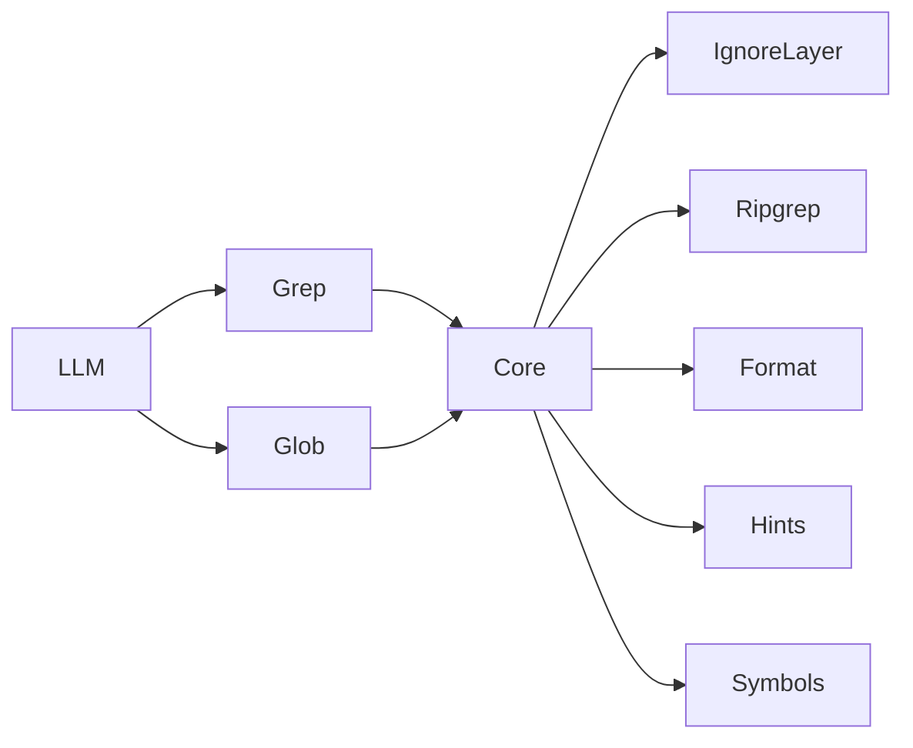

# Melhorias de busca (Grep / Glob)

## Status

| Campo | Valor |
|-------|-------|
| Estado geral | Concluído |
| Fase atual | — |
| Próxima fase | — |
| Última atualização | 2026-07-31 |

### Fases

| Fase | Nome | Status | Notas |
|------|------|--------|-------|
| 1 | Núcleo interno compartilhado | concluída | `search_core.py`; Grep/Glob só delegam; MCP intacto |
| 2 | Ignore layers + source-first | concluída | defaults + `.code-harnessignore`; `include_all` |
| 3 | Formato Grep agrupado por arquivo | concluída | heading + sumário multi-arquivo |
| 4 | Brace expansion e multi-glob | concluída | `search_globs.py`; lista + `{a,b}` |
| 5 | Hints em zero resultados | concluída | `search_hints.py`; até 4 sugestões |
| 6 | Symbols/outline no Grep | concluída | `symbols/`; `output_mode=symbols` |

**Como atualizar este cabeçalho**

- Ao **iniciar** uma fase: `Estado geral` → `Em andamento`; `Fase atual` → número e nome; status da linha → `em andamento`.
- Ao **concluir** uma fase: status da linha → `concluída` (+ nota curta se útil); `Próxima fase` → a seguinte; `Última atualização` → data do dia.
- Ao terminar a Fase 6: `Estado geral` → `Concluído`; `Fase atual` / `Próxima fase` → `—`.

Statuses admitidos na coluna **Status**: `pendente` | `em andamento` | `concluída` | `cancelada`.

---

## Decisão de superfície

- **MCP permanece com `Grep` e `Glob`** — nomes que os modelos já conhecem; melhor acerto de tool-call.
- **Nenhuma tool nova** (`Search`, Outline, FindSymbol, Explore).
- **Internamente:** módulo/núcleo compartilhado (o que um rascunho chamava `search`) com ignores, formato, braces, hints e símbolos; `grep`/`glob` (e o registro MCP) delegam a esse núcleo.
- Resultado líquido de tools: **inalterado** (não cresce, não remove Grep/Glob).

### Por que não rename para Search

Modelos de agente têm prior forte em `Grep` = conteúdo e `Glob` = arquivos. Uma tool `Search` com `mode` exige reaprender o schema e tende a piorar desempenho de tool-use. Unificar implementação **não** exige unificar o nome na API MCP.

### API MCP (estável; só enriquece)

**Grep** — como hoje, mais:

| Parâmetro / evolução | Papel |
| -------------------- | ----- |
| `pattern`, `path`, `glob`, `type`, context*, `multiline`, `head_limit`, `offset` | iguais aos atuais |
| `output_mode` | `content` \| `files_with_matches` \| `count` \| `symbols` |
| `include_all` | bypass do source-first (Fase 2); default `false` |

**Glob** — como hoje, mais:

| Parâmetro / evolução | Papel |
| -------------------- | ----- |
| `glob_pattern` | aceita braces `{A,B}` e, se útil, lista (Fase 4) |
| `target_directory` | igual ao atual |
| `include_all` | mesmo bypass da Fase 2 |

Descriptions das tools devem mencionar defaults (source-first) e novos modos, sem mudar o vocabulário Grep/Glob.

### Arquivos centrais

- Novo (interno): `src/code_harness/tools/search_core.py`, `search_ignores.py`, `search_globs.py`, `search_hints.py`
- Símbolos: `src/code_harness/symbols/` (extractors + SymbolStore; não é tool MCP)
- Hoje: `src/code_harness/tools/grep.py`, `glob.py`, `src/code_harness/ripgrep.py`
- MCP: `src/code_harness/mcp/server.py` — **mantém** `Grep`/`Glob`; só atualiza descriptions/params ao longo das fases
- Docs: `docs/tools.md`, `docs/search-improvements.md` (este arquivo), `CHANGELOG.md`
- Testes: `tests/test_search_tools.py`, `tests/test_symbol_*.py`

---

## Fase 1 — Núcleo interno compartilhado (sem mudar MCP)

**Status:** concluída (2026-07-31)

- Extrair núcleo comum (args ripgrep, PathGuard, caps, montagem de globs).
- `tools.grep` / `tools.glob` passam a delegar ao núcleo **sem mudar semântica ainda** (formato flat, mesmos ignores).
- MCP continua registrando `Grep` e `Glob`; sem tool `Search`.
- Refatoração + testes verdes; docs só se necessário (nota de arquitetura interna).

**Entrega:** `src/code_harness/tools/search_core.py` com `base_rg_arguments`, `grep_content`, `list_files` e renderização; wrappers finos em `grep.py` / `glob.py`.

**Critério de pronto:** mesma cobertura de `test_search_tools.py`; MCP ainda lista Grep e Glob; nenhum rename na superfície.

---

## Fase 2 — Ignore layers + source-first

**Status:** concluída (2026-07-31)

- Camada de ignore do harness além do `.gitignore`: defaults (ex. `.code-harness/`, caches comuns, `*.err` de amostras) + arquivo opcional do projeto (ex. `.code-harnessignore`).
- Default **source-first**; `include_all=true` em Grep e Glob desliga.
- Aplicar via globs negativos no ripgrep no núcleo (`ripgrep.py` / args do core).
- Rodapé opcional se hits de ruído forem omitidos (“pass include_all=true”).

**Entrega:** `src/code_harness/tools/search_ignores.py`; `include_all` em Grep/Glob (MCP + CLI); nota quando o resultado filtrado é vazio mas paths ignorados batem.

**Critério de pronto:** Grep/Glob default não retornam `.code-harness/cli-samples/*.err`; com `include_all` retornam.

---

## Fase 3 — Formato de saída do Grep agrupado por arquivo

**Status:** concluída (2026-07-31)

- Em `output_mode=content`, estilo heading (path uma vez; linhas só `lineno:texto` / `lineno-texto`).
- Sumário no topo quando houver vários arquivos: `N matches in M files`.
- Ajustar asserts em testes que hoje esperam `path:line:text` em toda linha.

**Entrega:** `render_content` / `append_line` em `search_core.py`; docs e testes atualizados.

**Critério de pronto:** resultado multi-arquivo sem path repetido por linha; paging (`head_limit`/`offset`) correto.

---

## Fase 4 — Braces e multi-glob (Glob + filtro `glob` do Grep)

**Status:** concluída (2026-07-31)

- Expandir `{A,B,C}` e `*.{ts,tsx}` no harness antes do ripgrep.
- Aceitar padrão único expandido e, se couber no schema MCP, lista de padrões; união, dedupe, sort por mtime no Glob.
- Erro `InvalidArgumentError` claro se brace malformado — nunca “No files found” silencioso.

**Entrega:** `src/code_harness/tools/search_globs.py`; `glob` / `glob_pattern` aceitam `str | list[str]` no MCP.

**Critério de pronto:** `Glob(glob_pattern="*.{py,md}")` e filtro equivalente no Grep funcionam.

---

## Fase 5 — Hints genéricos em zero resultados

**Status:** concluída (2026-07-31)

- Em Grep/Glob sem matches: além de `No matches found.` / `No files found...`, 2–4 sugestões genéricas (ex.: `case_insensitive`, afrouxar regex, tentar Glob com `*pattern*`, `include_all`, `type`/`glob`).
- Sem heurísticas de domínio (nada de “RNW → RN”).

**Entrega:** `src/code_harness/tools/search_hints.py`; integrado em `grep_content` / `list_files` quando o resultado é vazio.

**Critério de pronto:** empty response ensina o próximo passo; não inventa símbolos do projeto.

---

## Fase 6 — Símbolos/outline **dentro do Grep**

**Status:** concluída (2026-07-31)

- Novo valor de `output_mode=symbols` no Grep; **sem tool nova**.
- Pacote `code_harness.symbols`: extractors por linguagem + `SymbolStore` (OnDemand) + render.
- Outline quando `path` é arquivo; find no projeto exige `pattern` não vazio.
- Grep `content` / `files_with_matches` / `count` inalterados.

**Entrega:** `src/code_harness/symbols/` (`models`, `extractors`, `languages/*`, `store`, `service`).

**Critério de pronto:** `output_mode=symbols` reduz cascata Grep→Read para descoberta de definição/outline.

---

## Ordem e dependências

1 → 2 → 3 → 4 → 5 → 6

Fases 3 e 4 são independentes entre si após 2; a ordem prioriza legibilidade (3) antes de braces (4). Fase 5 depois do formato novo. Fase 6 por último.

## Fora de escopo

- Renomear/substituir Grep e Glob por Search na API MCP
- LSP / go-to-definition preciso / índice SQLite na v1
- Novas tools MCP
- Heurísticas acopladas a um produto/framework específico
